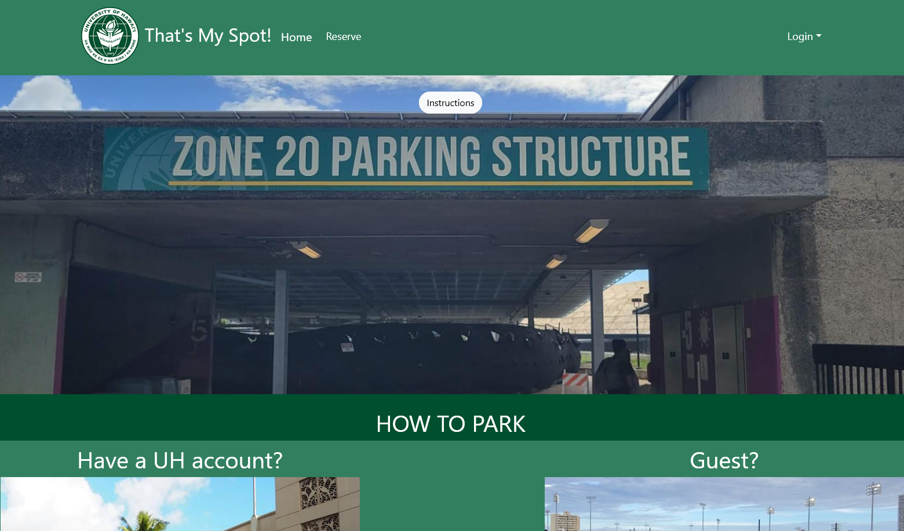

## What is it?

## Basic Rundown

## Difficulties

## Future Possibilities

## More Detail

For more details on the project, please visit the github page link <a href="https://manoa-inventory-post.github.io/">here</a>.

## Meet The Team!
