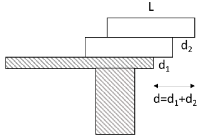
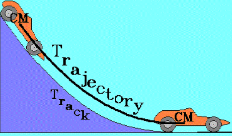
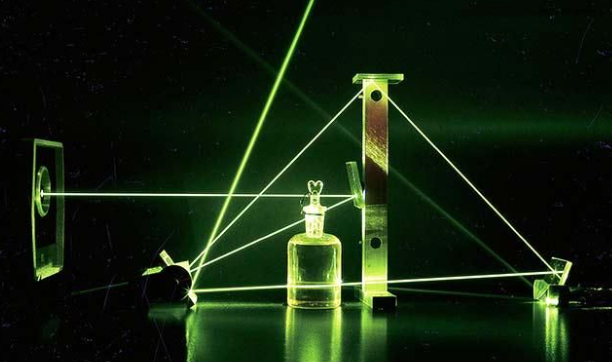
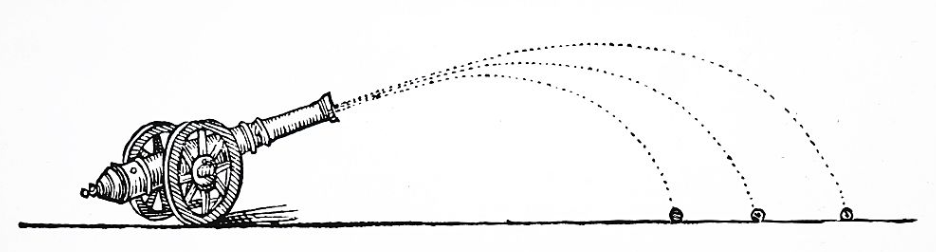

## Physics Olympic Team

As part of our Physics course in high school, a group of students were compiled to compete to represent William McKinley High School in the annual Physics Olympics Competition which was held at Kapiolani Communinity College. Students from different High Schools around the island of Oahu would come together to participate in the competition to demonstrate the abilities of each school.

## Block Stacking

In the first event, our task was to create a stack of blocks such that they would extend the farthest off the table without falling off. The strategy in this event was to create a strong base in which would allow us to stack the blocks in a horizontal fashion to extend off the table. This event was challenging but as a team we were able to create a long enough "bridge" allowing us to beat all the participating teams.

## Rolling Car Trajectory

For this next event, our objective was to drop a toy car onto a ramp to make it travel the farthest disance. To make things interesting, we were given a small glob of clay which we would use to increase the weight of the toy car. Using the clay, we increased the weight of the car to lower the center of gravity which, in turn, made the toy car travel much further than our competitors.

## Laser Reflection

In this event, we were given a series of mirrors and a single laser. Our objective was to use the least amount of mirrors to reflect our laser onto the final screen. The only catch is that we were only able to turn on the laser one time, at the time of judging. Because of this, we had to use the reflection properties of mirrors and calculate the angle at which the laser would bounce off the mirror.

## Cannon Trajectory

In the last event we placed first in, we were given a slingshot with several metal beads. Our objective was to shoot the bead as far as possible in the least amount of tries. In this case, we had to calculate how to get the right angle knowing the farthest distance and the weight of the bead.

## Overall

Our team placed first in all four of these events and we all walked away with blue ribbons. However, there were still a few other events we did not place in but we are proud to say we walked away with the most blue ribbons of all the participating schools.
