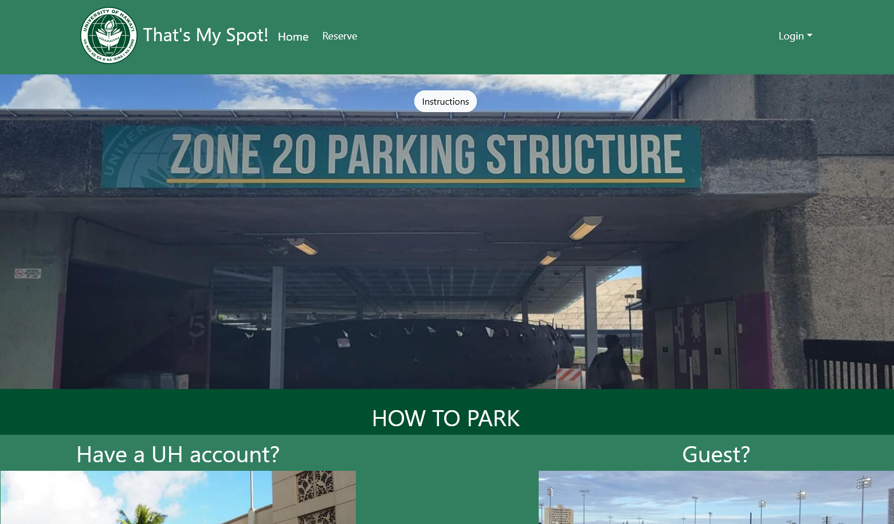

## What is it?

This project was an assignment for my ICS 314 final project. This project includes javascipt coding with ESlint implementation, all of which is deployed via digital ocean to <a href="https://uhmthatsmyspot.com/">That's My Spot</a>.

## Basic Rundown

One of the biggest problems that UH Manoa student and faculty face is parking. While there may be a large parking structure to accomodate, the university only sells a certain number of parking passes. Even with a pass, it is not guaranteed to obtain a stall, which makes it unfair for those who pay money to park. This is why my team and I created _That's My Spot!_.This application contains a database in which allows users _with UH accounts (for further development)_ to login with their UH credentials. Whether that user has a parking pass or not, they would be able to reserve a stall of their choice and park there until they leave. For guests, they would be able to reserve a stall but at the cost of choice of location since they do not own a parking pass. The application will assign you a parking stall and you simply park there, no more countless circles around the parking structure.

## Difficulties

With the project being worked on for the span of a month or so, it was not clear on how often we would have the chance to work on the project. Even if the group met a few times a week to work on it, there would be times where no progress was made due to the lack of understanding. It took time to get to a point where we were able to make steady progress, but at that point it was already late into the semester and we were not able to allocate time well. Had we known on what to do and how to do it from the start, the project would be in a much better state than it is now.

## Future Possibilities

With much more alloted time, the possibility of future improvements is endless. One of the main changes that I would add is UH Manoa account implementation. UH Manoa currently has their own system for logging in. Since the UH database will hold a lot of information like holds, whether you own a pass or not, or if you are a current student, this would play a role in whether you are classified as a "Guest" or not. This would also allow us to restrict certain accounts depending on financial obligations and other reasonings. However, since the development of _That's My Spot_ ends here, we will never see the full capabilities of this project in the future. Hopefully, in the future, this project will appeal to someone much more knowledgable than I and see the entire project.

## More Detail

For more details on the project, please visit the github page link <a href="https://thats-my-spot.github.io/">here</a>.

## Meet The Team!
* [Jayden Tactay](https://jaydent22.github.io/)
* [Trey Yasunaga](https://yertsti.github.io/)
* [Geoffrey Teocson](https://gteocson.github.io/)
* [Eduardo Kho Jr.](https://eduardokhojr.github.io/)
